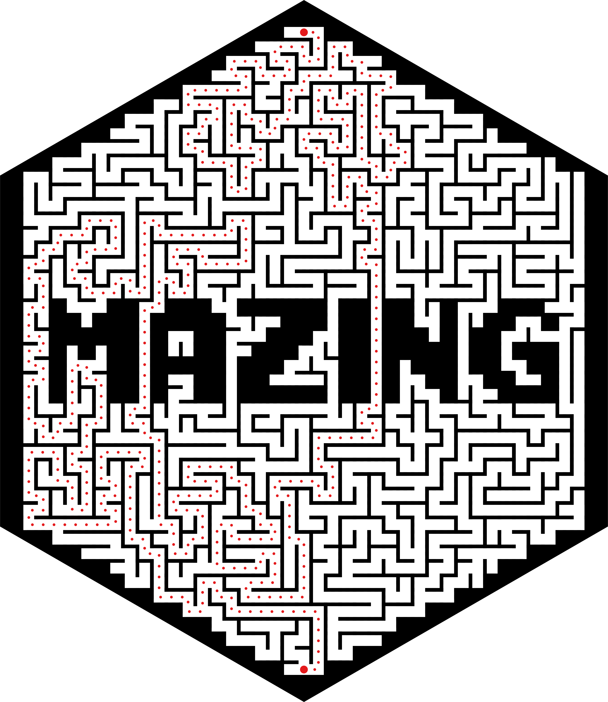

```{r setup, include=FALSE}
knitr::opts_chunk$set(echo = TRUE, cache = TRUE)
library(mazing)
oldpar <- par(mar=c(0,0,0,0))
```

Hi! Thanks for checking out the `mazing` package! In this document, I'll provide examples of some of the things you can do with the package and hopefully inspire you to make some cool mazes of your own.

## Creating mazes

The most basic functionality of `mazing` is producing a rectangular maze, which we do with the `maze` function.

```{r m1}
m <- maze(35,100)
plot(m, lwd = 3)
```

We can also produce mazes from existing binary matrices. This allows us to create mazes in a wider variety of shapes!

```{r mcircle}
mat <- matrix(1, 20, 20)
for(i in 1:nrow(mat)){
    for(j in 1:ncol(mat)){
        if((i-10.5)^2+(j-10.5)^2 > 100){
            mat[i,j] <- 0
        }
    }
}
m <- as.maze(mat)
plot(m, lwd = 4)
```

This is also how I produced the hexagonal maze for the sticker:

{#id .class width=250}


## Plotting mazes
There are two ways to plot a \code{maze} object: by showing either the paths or the walls of the maze. Above, we plotted the paths, so here's what it would look like if we plotted the walls:
```{r mcircWalls}
plot(m, walls = TRUE)
```

Or both together:
```{r mcircBoth}
plot(m, walls = TRUE)
lines(m, lwd = 3, col = 2)
legend('topright', lwd = c(1,3), col = c(1,2), legend = c('walls','paths'), bty = 'n')
```

### Openings
Sometimes, we may want to leave an opening in a wall to indicate the entrance and exit to a maze. When plotting the walls of the maze, we can specify a section of wall to omit by using the `openings` and `openings_direction` arguments. The first gives a location in the maze and the latter indicates which wall we want to omit, relative to that location. For example:
```{r openings}
plot(m, walls = TRUE, openings = c('left','right'),
     openings_direction = c('left','right'))
```

With a little creativity, we can also use this to create a larger open area in the middle of the maze (you know, for the minotaur):
```{r openings2}
lair <- matrix(c(10,10,11,11, 10,11,10,11), ncol = 2)
plot(m, walls = TRUE, openings = lair, openings_direction = 'all')
points(10.5,10.5, pch = 6, col = 'brown')
points(10.5,10.5, pch = 20, col = 'brown')
```

### Adjustments
We can also add an offset to shift the entire maze by a fixed vector. This can be used to create a 3D effect or just a funky layering effect.
```{r mAdjust}
plot(m, lwd = 8)
lines(m, lwd = 8, col = 4, adjust = c(.2,.2))
```

```{r mAdjust2}
plot(m, lwd=10, col = 'pink')
lines(m, lwd=8, col = 'black', adjust = c(.2,.2))
lines(m, lwd=6, col='turquoise', adjust = c(.4,.4))
```


## Solving mazes
While it can be fun to get lost in a maze, sometimes we just want the computer to solve it for us. This looks like a job for `solve_maze`!
```{r solve}
p <- solve_maze(m, start = 'left', end = 'right')
plot(m, walls = TRUE)
lines(p, lwd = 3, col = 2)
```

Keywords like `'left'`, `'top'`, and `'bottomright'` can be used to identify reference points within a maze. If we want to add these points to a plot, we can use the `find_maze_refpoint` function.
```{r solvepoints}
plot(m, walls = TRUE)
lines(p, lwd = 3, col = 2)
# add start and end points
endpoints <- find_maze_refpoint(c('left','right'), m)
points(endpoints, pch = 16, col = c(3,2))
```

But we can also reference specific locations in the maze by coordinates, if it doesn't align with a reference point.
```{r customsolve}
start <- c(10, 3)
end <- c(15, 16)
p <- solve_maze(m, start = start, end = end)

plot(m, walls = TRUE)
lines(p, lwd = 3, col = 2)
# add start and end points
points(rbind(start,end), pch = 16, col = c(3,2))
```


## Maze-within-a-maze

One thing I found myself wanting to do was to make a maze-within-a-maze. I was finally able to achieve this with the `expand_matrix` and `widen_paths` functions.

```{r msquared, fig.height=8}
m <- maze(10, 10)
m <- maze2binary(m)
m <- expand_matrix(expand_matrix(expand_matrix(m)))
m <- widen_paths(widen_paths(widen_paths(m)))
m <- as.maze(m)
plot(m, lwd=2)
```

Another thing I wanted to do was to make a maze from an arbitrary image. The external function `png::readPNG` makes this surprisingly easy!

First, we have to create an example image, so we'll use the `emojifont` package to make a little elephant.
```{r external}
require(emojifont)
file <- tempfile(pattern = 'elephant', fileext = 'png')
png(file, width = 500, height = 500)
par(mar=c(0,0,0,0))
plot(1, 1, cex=0, axes = FALSE, xlab = '', ylab = '')
text(1, 1, labels = emoji('elephant'), cex=30, family='EmojiOne')
dev.off()
```

Then we'll read in the PNG image, which consists of four channels (RGB and alpha), and use it to create our maze. The image is a bit large, so we also condense it using `condense_matrix`.
```{r elephantmaze, fig.height=8}
require(png)
mat <- readPNG(file)
mat <- round(mat[,,1]) # red channel
mat <- condense_matrix(condense_matrix(mat))
mat <- round(mat)
# reverse the order of the rows to flip vertically
m <- as.maze(mat[nrow(mat):1,])

par(mar=c(0,0,0,0))
plot(c(1,ncol(m)), c(1,nrow(m)), cex = 0, asp = 1)
rect(par("usr")[1], par("usr")[3], par("usr")[2], par("usr")[4], col =  "black")
lines(m, lwd = 3, col = 'white', lend = 2)
```

## Session Info
```{r reset, echo=FALSE}
par(oldpar)
```

```{r info}
sessionInfo()
```